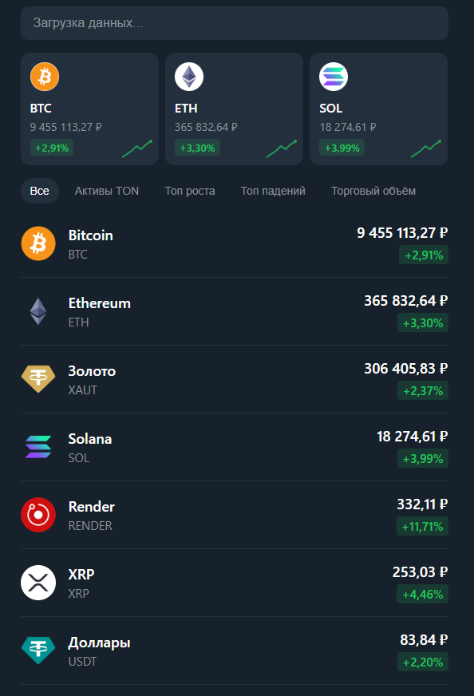

# 🚀 Telegram Crypto App Analyzer

Веб-приложение для отслеживания криптовалют с интеграцией в Telegram.



## ✨ Функции

- 📊 **Отслеживание курсов** криптовалют в реальном времени
- 💰 **Управление балансом** и портфелем
- 📱 **Интеграция с Telegram** Bot API
- 🎯 **Drag & Drop** интерфейс для управления активами
- 💾 **Локальное сохранение** данных
- 🔍 **Поиск** по названию криптовалют
- 📈 **Sparkline графики** изменения цен

## 📁 Структура проекта

```
tg_app_crypto/
├── frontend/           # Фронтенд приложение
│   ├── index.html     # Главная страница
│   ├── app.js         # Основная логика приложения
│   ├── api.js         # API для работы с криптовалютами
│   └── style.css      # Стили интерфейса
├── backend/           # Backend на Go
│   └── main.go        # Основной файл сервера
├── data/              # Данные приложения
│   └── balance.json   # Файл с балансом пользователя
├── images/            # Скриншоты и изображения
└── .vscode/           # Настройки VS Code
```

## 🛠 Технологии

- **Frontend**: HTML5, CSS3, JavaScript (Vanilla)
- **Backend**: Go
- **API**: CoinGecko API для получения курсов криптовалют
- **Storage**: JSON файлы для локального хранения

## 🚀 Запуск проекта

### Frontend
```bash
cd frontend
npx http-server -p 3000
```

### Backend
```bash
cd backend
go run main.go
```

## 📋 TODO

- [ ] Добавить поиск по первой букве
- [ ] Переработать дизайн
- [ ] Добавить аналитику с CoinGecko
- [ ] Пофиксить картинки
- [ ] Добавить пул отслеживаемых
- [ ] Добавить уведомления о изменении курсов
- [ ] Улучшить мобильную версию

## 📞 Контакты

Проект разработан для Telegram бота анализа криптовалют.

---

**Версия**: v1.0.0  
**Автор**: flizity
